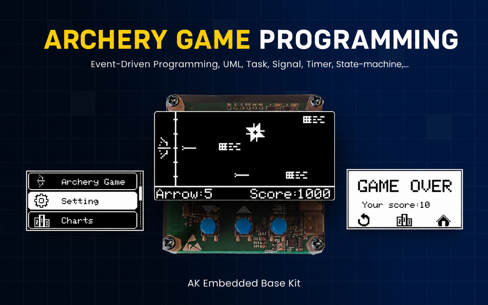
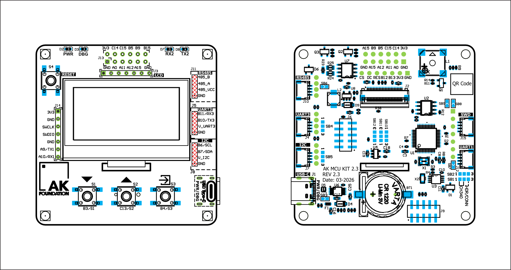
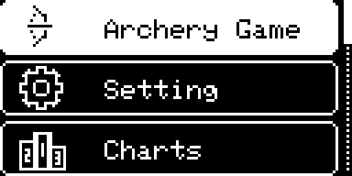
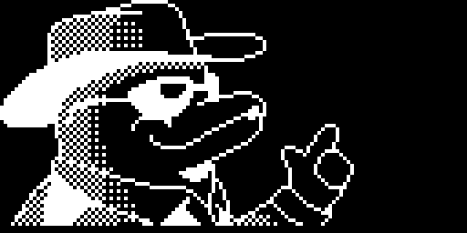
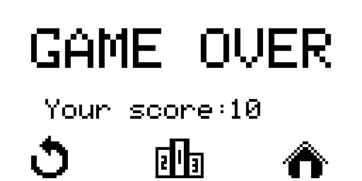
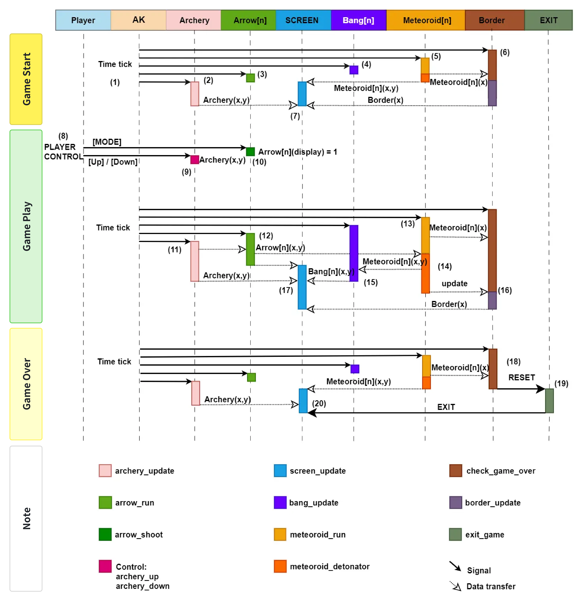

# Archery Game - Build on AK Embedded Base Kit

<table>
  <tr>
    <td align="center"></td>
  </tr>
</table>

<div align="center">
    <video src="https://github.com/ak-embedded-software/archery-game/assets/54855481/d493703c-bf5b-4fd2-ae04-b86784a01231" alt="epcb archery game" height=200/>
</div>

## Documentation

| File | Description |
|---|---|
| [README.md](README.md) | Main project overview, hardware information, gameplay rules, and object descriptions. |
| [docs/runtime-signal-processing.md](docs/runtime-signal-processing.md) | Runtime signal-processing flow for button input, AK task messages, timers, game-loop ticks, object updates, and Mermaid sequence diagrams. |
| [docs/eeprom-data-storage.md](docs/eeprom-data-storage.md) | EEPROM storage layout for game settings and scores, including magic-number validation, checksum protection, read/write flow, and related APIs. |
| [docs/game-object-sequences.md](docs/game-object-sequences.md) | Runtime sequence diagrams for gameplay objects: Archery, Arrow, Meteoroid, Bang, and Border. |
| [docs/display-design.md](docs/display-design.md) | Display design notes for screen layout, bitmap assets, rendering flow, and screen transitions. |
| [docs/buzzer-audio.md](docs/buzzer-audio.md) | Buzzer and audio behavior notes for sound effects, silent mode, playback timing, and related APIs. |

## I. Introduction

The Archery game is a game running on the AK Embedded Base Kit. It is built to help embedded programming enthusiasts learn and practice event-driven programming. During the development of the archery game, you will learn more about designing and applying UML, Tasks, Signals, Timers, Messages, State-machines,...

### 1.1 Hardware

<table align="center">
  <tr>
    <td align="center"></td>
  </tr>
</table>
<p align="center"><strong><em>Figure 1:</em></strong> AK Embedded Base Kit - STM32L151</p>

[AK Embedded Base Kit](https://epcb.vn/products/ak-embedded-base-kit-lap-trinh-nhung-vi-dieu-khien-mcu) is an evaluation kit for advanced embedded software learners.

The KIT integrates **1.54" Oled LCD**, **3 push buttons**, and **1 Buzzers** that play music, to learn **the event-driven system** through hands-on game machine design.
The KIT also integrates **RS485**, **Qwiic Connect System**, and **Grove Ecosystems**, suitable for prototyping practical applications in embedded systems.

#### 1.1.1 MCU Overview

```text
SoC Name : STM32L151CBT6
RAM      : 16 KB

Flash Partitions Layout
----------------------
[ 0x08000000 - 0x08001FFF ] : Bootloader Partition (8 KB)
=> AK Bootloader

[ 0x08002000 - 0x08002FFF ] : BSF Shared Partition (4 KB)
=> Used for data sharing between Bootloader and Application

[ 0x08003000 - 0x0801FFFF ] : Application Partition (116 KB)
=> Archery Game firmware
```

SoC name breakdown:

| Part | Meaning |
|---|---|
| `STM32` | STMicroelectronics 32-bit MCU family. |
| `L` | Low-power series. |
| `151` | STM32L151 product line. |
| `C` | 48-pin package. |
| `B` | 128 KB Flash memory. |
| `T` | LQFP package. |
| `6` | Industrial temperature grade. |


<table align="center">
  <tr>
    <td align="center"></td>
  </tr>
</table>
<p align="center"><strong><em>Figure 2:</em></strong> Board view Top + Bottom </p>

### 1.2 Game Description and Objects
The following description of the **“Archery game”**, explains how to play and the game's processing mechanism. This document is used for reference in designing and developing the game later.

<table align="center">
  <tr>
    <td align="center"></td>
  </tr>
</table>
<p align="center"><strong><em>Figure 2:</em></strong> Menu game</p>

The game starts with the **Menu game** screen with the following options:
- **Archery Game:** Select to start the game.
- **Setting:** Select to set the game parameters.
- **Charts:** Select to view the top 3 highest scores.
- **Exit:** Exit the menu to the standby screen.

<table align="center">
  <tr>
    <td align="center"></td>
  </tr>
</table>
<p align="center"><strong><em>Figure 3:</em></strong> Game play screen and objects</p>

#### 1.2.1 Objects in the Game:
|Object|Object Name|Description|
|---|---|---|
|**Bow**|Archery|Move up/down to select the position to shoot the arrow|
|**Arrow**|Arrow|Shot from the bow, used to destroy meteoroids|
|**Explosion**|Bang|Effect that appears when meteoroid is destroyed|
|**Border**|Border|Safe zone to protect from meteoroids falling into|
|**Meteoroid**|Meteoroid|Object flying towards the bow with increasing speed, capable of destroying the border|

**(*)** In the rest of the document, the names of the objects will be used to refer to the objects.

#### 1.2.2 How to Play:
- In this game, you will control the Archery, move **up/down** with the **[Up]/[Down]** buttons, to select the position to **shoot** the Arrow.
- When pressing the **[Mode]** button, the Arrow will be shot, aiming to destroy the incoming Meteoroids.
- The goal of the game is to get as many points as possible, the game will end when a Meteoroid touches the Border.

#### 1.2.3 Game Mechanics:
- **Scoring:** Points are calculated by the number of Meteoroids destroyed. Each destroyed Meteoroid corresponds to 10 points. The accumulated score will be displayed in the bottom right corner of the screen.
- **Difficulty:** Every time 200 points are accumulated, the Meteoroid's flying speed will increase by one level. The initial difficulty can be set in the **Setting** section.
- **Arrow Limit:** When shooting, the number of available Arrows will decrease corresponding to the number of flying Arrows, if the available Arrows decrease to "0", you cannot shoot and there will be a warning sound. The number of available Arrows will be restored when a Meteoroid is destroyed or the Arrow flies off the screen. The number of Arrows is displayed in the bottom left corner of the screen and can be changed in the **Setting**.

- **Animation:** To make the game more lively, objects will have additional animation when moving.
- **Game Over:** When a Meteoroid touches the Border, the game will end. Objects will be reset and the score will be saved. You will enter the “Game Over” screen with 3 options:
  - **Restart:** play again.
  - **Charts:** go to view the leaderboard.
  - **Home:** back to the game menu.

<table align="center">
  <tr>
    <td align="center"></td>
  </tr>
</table>
<p align="center"><strong><em>Figure 5:</em></strong> Game_over screen 1</p>

<table align="center">
  <tr>
    <td align="center"></td>
  </tr>
</table>
<p align="center"><strong><em>Figure 6:</em></strong> Game_over screen 2</p>

### 1.3 Basic Game Sequence Logic

<table align="center">
    <td align="center">For a more detailed sequence flow, see <a href="docs/runtime-signal-processing.md">Runtime Signal Processing</a>.</td>
  </tr>
  <tr>
    <td align="center"></td>
  </tr>
  <tr>
</table>
<p align="center"><strong><em>Figure 4:</em></strong> Basic game sequence logic</p>

## Contact & Support
**Phan Quoc Buu** - Embedded Software Engineer <br/>
``` Note
Thank you for visiting this repository.  
If you have any questions, suggestions, or feedback about this project or firmware development, feel free to contact me directly
```

**My contact:** <br/>
<a href="https://github.com/QuocBuu">
  
</a>
<a href="https://www.linkedin.com/in/phan-quoc-buu-549336321">
  
</a>
<a href="mailto:pquocbuu@gmail.com">
  
</a>
